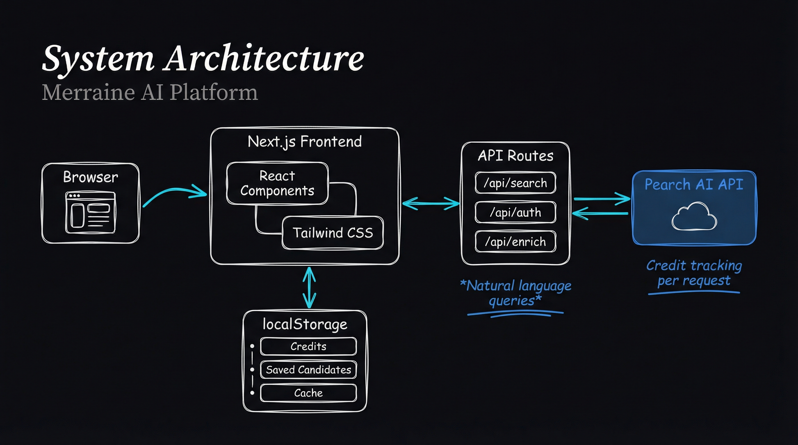
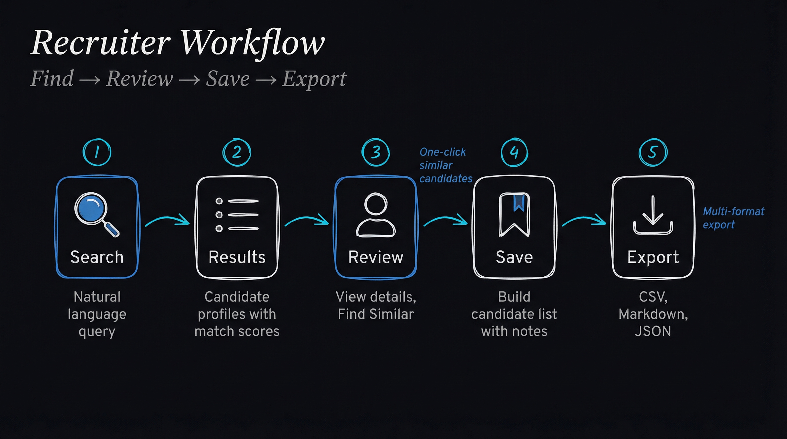

# Merraine AI

A modern, AI-powered recruiting platform that helps recruiters find qualified candidates using natural language search. Built on the [Pearch AI](https://pearch.ai) API.



## Overview

Merraine AI streamlines the candidate sourcing process by allowing recruiters to search for candidates using plain English queries like *"Senior React developers in Austin with startup experience"* instead of complex boolean searches. The platform provides transparent credit tracking, candidate management, and multiple export formats for seamless integration with existing workflows.

## Features

### Core Capabilities

- **Natural Language Search** - Find candidates using conversational queries
- **Smart Location Filtering** - Filter by city, state, or region
- **Contact Reveal** - Access verified emails and phone numbers on demand
- **Candidate Management** - Save, organize, and annotate candidates
- **Find Similar** - One-click discovery of candidates similar to ones you like
- **Multi-Format Export** - Export to CSV, Markdown, or JSON

### Search Options

| Option | Cost | Description |
|--------|------|-------------|
| Fast Search | 1 credit/profile | Quick results for initial screening |
| Pro Search | 5 credits/profile | Detailed profiles with more data |
| AI Insights | +1 credit | AI-generated candidate summary |
| Fresh Data | +2 credits | Most recent profile information |
| Reveal Email | +2 credits | Verified email address |
| Reveal Phone | +14 credits | Phone number access |

### Additional Features

- **Persistent Search Cache** - Results survive page navigation (1-hour expiry)
- **Credit Tracking** - Real-time usage monitoring with threshold alerts
- **Dashboard View** - At-a-glance metrics and quick actions
- **In-App Help** - Comprehensive guide for new users

## Tech Stack

- **Framework**: [Next.js 14](https://nextjs.org/) (App Router)
- **Language**: [TypeScript](https://www.typescriptlang.org/)
- **Styling**: [Tailwind CSS](https://tailwindcss.com/)
- **API**: [Pearch AI](https://pearch.ai)
- **State**: React Hooks + localStorage

## Getting Started

### Prerequisites

- Node.js 18+
- npm or yarn
- Pearch AI API key ([get one here](https://pearch.ai))

### Installation

1. **Clone the repository**
   ```bash
   git clone https://github.com/L4zerow/merraine-ai.git
   cd merraine-ai
   ```

2. **Install dependencies**
   ```bash
   npm install
   ```

3. **Configure environment variables**
   ```bash
   cp .env.example .env.local
   ```

   Edit `.env.local` with your credentials:
   ```env
   PEARCH_API_KEY="pk_your_api_key_here"
   AUTH_USERNAME="your_username"
   AUTH_PASSWORD="your_secure_password"
   ```

4. **Start the development server**
   ```bash
   npm run dev
   ```

5. **Open the app**

   Navigate to [http://localhost:3000](http://localhost:3000)

### Available Scripts

| Command | Description |
|---------|-------------|
| `npm run dev` | Start development server |
| `npm run build` | Build for production |
| `npm run start` | Start production server |
| `npm run lint` | Run ESLint |
| `npm run type-check` | Run TypeScript compiler check |

## Project Structure

```
merraine-ai/
├── app/                    # Next.js App Router pages
│   ├── api/               # API routes (auth, search, enrich)
│   ├── search/            # Candidate search page
│   ├── saved/             # Saved candidates page
│   ├── help/              # In-app documentation
│   └── login/             # Authentication page
│
├── components/            # React components
│   ├── ui/               # Reusable UI components
│   ├── search/           # Search-specific components
│   └── ...               # Feature components
│
├── lib/                   # Utilities & business logic
│   ├── pearch.ts         # Pearch AI API client
│   ├── credits.ts        # Credit tracking system
│   ├── savedCandidates.ts # Local storage management
│   ├── findSimilar.ts    # Similar candidate search
│   ├── searchCache.ts    # Results caching
│   └── exportSearchResults.ts # Export utilities
│
└── public/               # Static assets
```

## API Integration

The application integrates with Pearch AI's REST API:

| Endpoint | Method | Purpose |
|----------|--------|---------|
| `/v2/search` | POST | Search for candidates |
| `/v1/profile` | GET | Enrich profile details |
| `/v1/upsert_jobs` | POST | Index jobs for matching |
| `/v1/find_matching_jobs` | POST | Match profiles to jobs |

All API calls are proxied through Next.js API routes for security.

## Environment Variables

| Variable | Required | Description |
|----------|----------|-------------|
| `PEARCH_API_KEY` | Yes | Your Pearch AI API key |
| `AUTH_USERNAME` | Yes | Login username |
| `AUTH_PASSWORD` | Yes | Login password |

## Usage



### Basic Search

1. Enter a natural language query (e.g., "Python developers in New York")
2. Optionally add location filter for more precise results
3. Select search type (Fast or Pro) and any enhancements
4. Click **Search Candidates**

### Find Similar Candidates

1. Click on any candidate to view their profile
2. Click **Find Similar** button
3. Search automatically runs with their profile attributes

### Export Candidates

1. After searching, click **Export** button
2. Choose format: CSV (spreadsheets), Markdown (documentation), or JSON (integrations)
3. File downloads with timestamped filename

## Contributing

1. Fork the repository
2. Create a feature branch (`git checkout -b feature/amazing-feature`)
3. Commit your changes (`git commit -m 'Add amazing feature'`)
4. Push to the branch (`git push origin feature/amazing-feature`)
5. Open a Pull Request

## License

This project is proprietary software. All rights reserved.

## Support

For questions or issues, please [open an issue](https://github.com/L4zerow/merraine-ai/issues) on GitHub.

---

Built with [Next.js](https://nextjs.org/) and [Pearch AI](https://pearch.ai)
